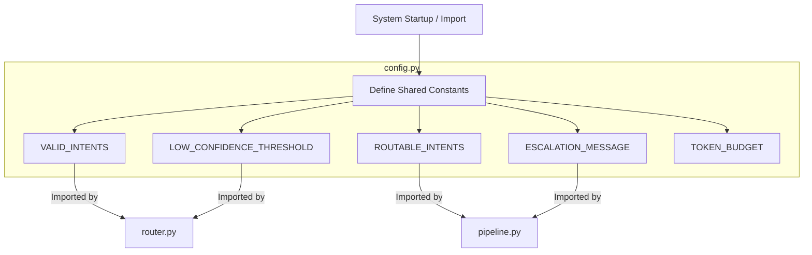

# config.py Flow

```mermaid
flowchart TD
    %% config.py is a static data store, so the flow represents how data is consumed.
    
    Start[System Startup / Import] --> DefineConstants[Define Shared Constants]
    
    subgraph config.py
        direction TB
        DefineConstants --> valid_intents[VALID_INTENTS]
        DefineConstants --> routable[ROUTABLE_INTENTS]
        DefineConstants --> threshold[LOW_CONFIDENCE_THRESHOLD]
        DefineConstants --> messages[ESCALATION_MESSAGE]
        DefineConstants --> tokens[TOKEN_BUDGET]
    end

    valid_intents -->|Imported by| router_py[router.py]
    threshold -->|Imported by| router_py
    
    routable -->|Imported by| pipeline[pipeline.py]
    messages -->|Imported by| pipeline
```
