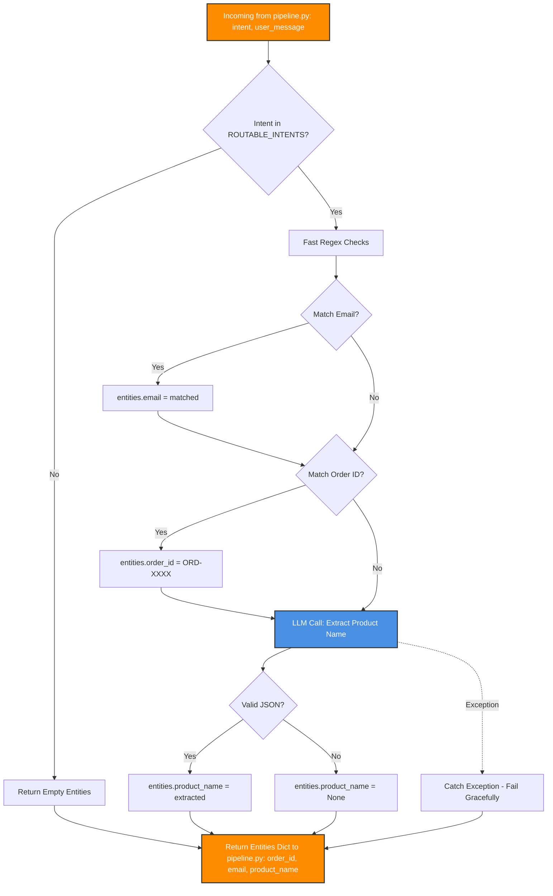

# entity_extractor.py Flow

```mermaid
flowchart TD
    classDef external fill:#FF8C00,stroke:#333,stroke-width:2px,color:#fff;
    classDef agent fill:#4A90E2,stroke:#333,stroke-width:2px,color:#fff;

    %% Entity Extractor Flow
    IncomingRequest[Incoming from pipeline.py: intent, user_message]:::external --> CheckIntent{Intent in ROUTABLE_INTENTS?}
    
    CheckIntent -->|No| FastReturn[Return Empty Entities]
    CheckIntent -->|Yes| RegexChecks[Fast Regex Checks]
    
    %% Regex
    RegexChecks --> CheckEmail{Match Email?}
    CheckEmail -->|Yes| SaveEmail[entities.email = matched]
    CheckEmail -->|No| CheckOrder{Match Order ID?}
    
    SaveEmail --> CheckOrder
    
    CheckOrder -->|Yes| SaveOrder[entities.order_id = ORD-XXXX]
    CheckOrder -->|No| CallLLM[LLM Call: Extract Product Name]:::agent
    SaveOrder --> CallLLM
    
    %% LLM
    CallLLM --> CheckParse{Valid JSON?}
    CheckParse -->|Yes| SaveProduct[entities.product_name = extracted]
    CheckParse -->|No| SkipProduct[entities.product_name = None]
    
    SaveProduct --> ReturnOutput[Return Entities Dict to pipeline.py: order_id, email, product_name]:::external
    SkipProduct --> ReturnOutput
    FastReturn --> ReturnOutput
    
    %% Error handling
    CallLLM -.->|Exception| CatchError[Catch Exception - Fail Gracefully]
    CatchError --> ReturnOutput
```
