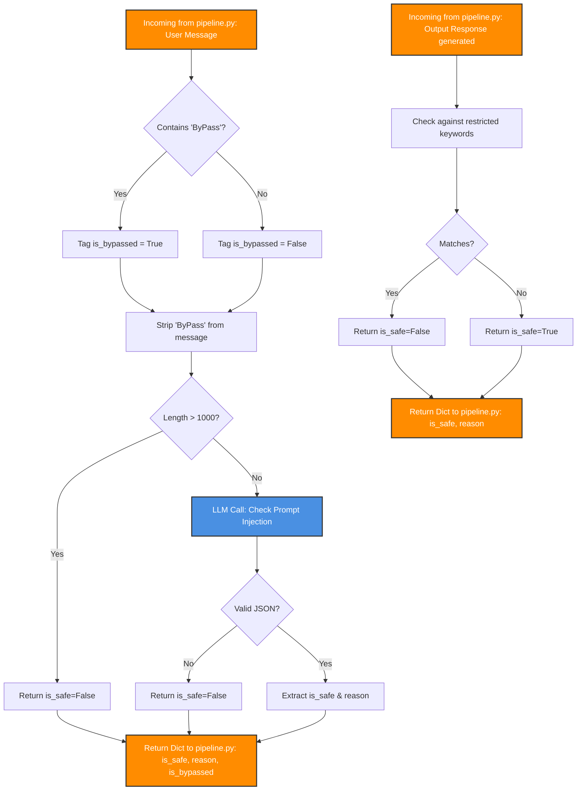

# guardrails.py Flow

```mermaid
flowchart TD
    classDef external fill:#FF8C00,stroke:#333,stroke-width:2px,color:#fff;
    classDef agent fill:#4A90E2,stroke:#333,stroke-width:2px,color:#fff;

    %% Input Guardrail Flow
    IncomingInput[Incoming from pipeline.py: User Message]:::external --> CheckBypass{Contains 'ByPass'?}
    CheckBypass -->|Yes| FlagBypass[Tag is_bypassed = True]
    CheckBypass -->|No| FlagNoBypass[Tag is_bypassed = False]
    
    FlagBypass --> CleanMsg[Strip 'ByPass' from message]
    FlagNoBypass --> CleanMsg
    
    CleanMsg --> CheckLength{Length > 1000?}
    CheckLength -->|Yes| BlockLength[Return is_safe=False]
    
    CheckLength -->|No| PromptInjectCheck[LLM Call: Check Prompt Injection]:::agent
    PromptInjectCheck --> JSONParse{Valid JSON?}
    
    JSONParse -->|No| FailClosed[Return is_safe=False]
    JSONParse -->|Yes| ExtractStatus[Extract is_safe & reason]
    ExtractStatus --> ReturnInput[Return Dict to pipeline.py: is_safe, reason, is_bypassed]:::external
    BlockLength --> ReturnInput
    FailClosed --> ReturnInput
    
    %% Output Guardrail Flow
    IncomingOutput[Incoming from pipeline.py: Output Response generated]:::external --> RegexCheck[Check against restricted keywords]
    RegexCheck --> FoundMatch{Matches?}
    FoundMatch -->|Yes| BlockLeak[Return is_safe=False]
    FoundMatch -->|No| AllowPass[Return is_safe=True]
    BlockLeak --> ReturnOutput[Return Dict to pipeline.py: is_safe, reason]:::external
    AllowPass --> ReturnOutput
```
