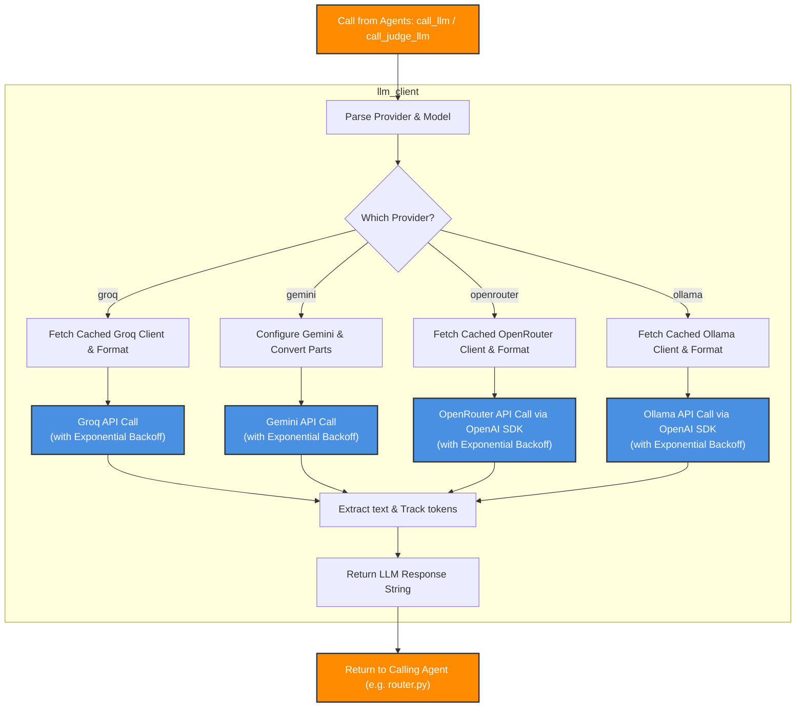

# llm_client.py Flow

```mermaid
flowchart TD
    classDef external fill:#FF8C00,stroke:#333,stroke-width:2px,color:#fff;
    classDef agent fill:#4A90E2,stroke:#333,stroke-width:2px,color:#fff;

    Incoming["Call from Agents: call_llm / call_judge_llm"]:::external --> ParseArgs["Parse Provider & Model"]
    
    subgraph llm_client
        direction TB
        ParseArgs --> CheckProvider{"Which Provider?"}
        
        CheckProvider -->|groq| FormatGroq["Fetch Cached Groq Client & Format"]
        CheckProvider -->|gemini| FormatGemini["Configure Gemini & Convert Parts"]
        CheckProvider -->|openrouter| FormatOpenRouter["Fetch Cached OpenRouter Client & Format"]
        CheckProvider -->|ollama| FormatOllama["Fetch Cached Ollama Client & Format"]
        
        FormatGroq --> ExecuteGroq["Groq API Call<br/>(with Exponential Backoff)"]:::agent
        FormatGemini --> ExecuteGemini["Gemini API Call<br/>(with Exponential Backoff)"]:::agent
        FormatOpenRouter --> ExecuteOpenRouter["OpenRouter API Call via OpenAI SDK<br/>(with Exponential Backoff)"]:::agent
        FormatOllama --> ExecuteOllama["Ollama API Call via OpenAI SDK<br/>(with Exponential Backoff)"]:::agent
        
        ExecuteGroq --> ParseResponse["Extract text & Track tokens"]
        ExecuteGemini --> ParseResponse
        ExecuteOpenRouter --> ParseResponse
        ExecuteOllama --> ParseResponse
        
        ParseResponse --> ReturnString["Return LLM Response String"]
    end

    ReturnString --> Outgoing["Return to Calling Agent (e.g. router.py)"]:::external
```
