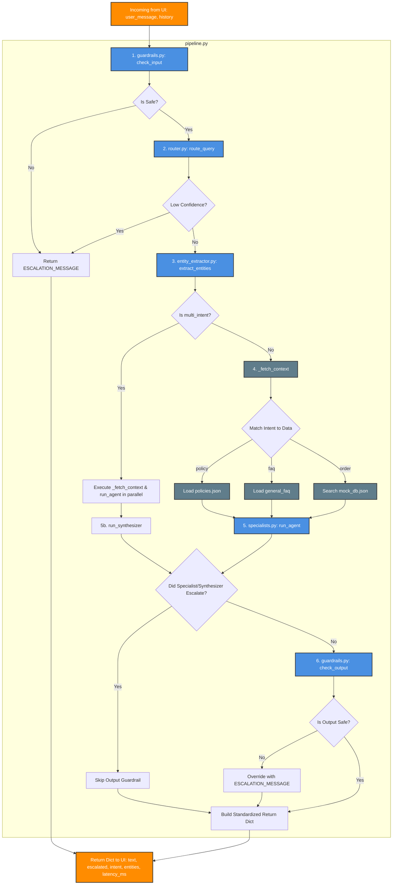

# pipeline.py Flow

```mermaid
flowchart TD
    classDef external fill:#FF8C00,stroke:#333,stroke-width:2px,color:#fff;
    classDef agent fill:#4A90E2,stroke:#333,stroke-width:2px,color:#fff;
    classDef util fill:#607D8B,stroke:#333,stroke-width:2px,color:#fff;

    Incoming[Incoming from UI: user_message, history]:::external --> InputGuard[1. guardrails.py: check_input]:::agent
    
    subgraph pipeline.py
        direction TB
        
        InputGuard --> CheckSafe{Is Safe?}
        CheckSafe -->|No| FailFast[Return ESCALATION_MESSAGE]
        
        CheckSafe -->|Yes| Route[2. router.py: route_query]:::agent
        
        Route --> CheckConf{Low Confidence?}
        CheckConf -->|Yes| FailFast
        
        CheckConf -->|No| Extract[3. entity_extractor.py: extract_entities]:::agent
        
        Extract --> MultiIntentCheck{Is multi_intent?}
        
        MultiIntentCheck -->|Yes| Parallel[Execute _fetch_context & run_agent in parallel]
        Parallel --> Synthesizer[5b. run_synthesizer]
        Synthesizer --> CheckEscalated{Did Specialist/Synthesizer Escalate?}

        MultiIntentCheck -->|No| Context[4. _fetch_context]:::util
        
        Context --> BuildContext{Match Intent to Data}
        BuildContext -->|policy| LoadPolicy[Load policies.json]:::util
        BuildContext -->|faq| LoadFAQ[Load general_faq]:::util
        BuildContext -->|order| LoadDB[Search mock_db.json]:::util
        
        LoadPolicy --> Exec[5. specialists.py: run_agent]:::agent
        LoadFAQ --> Exec
        LoadDB --> Exec
        
        Exec --> CheckEscalated
        
        CheckEscalated -->|Yes| SkipOutput[Skip Output Guardrail]
        CheckEscalated -->|No| OutputGuard[6. guardrails.py: check_output]:::agent
        
        OutputGuard --> OutSafe{Is Output Safe?}
        OutSafe -->|No| Override[Override with ESCALATION_MESSAGE]
        OutSafe -->|Yes| BuildReturn[Build Standardized Return Dict]
        
        SkipOutput --> BuildReturn
        Override --> BuildReturn
    end

    BuildReturn --> Outgoing[Return Dict to UI: text, escalated, intent, entities, latency_ms]:::external
    FailFast --> Outgoing
```
