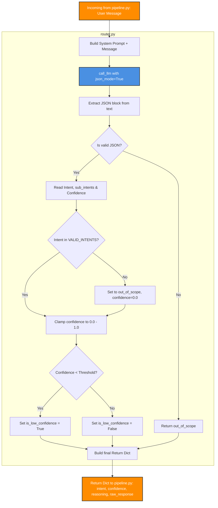

# router.py Flow

```mermaid
flowchart TD
    classDef external fill:#FF8C00,stroke:#333,stroke-width:2px,color:#fff;
    classDef agent fill:#4A90E2,stroke:#333,stroke-width:2px,color:#fff;

    Incoming[Incoming from pipeline.py: User Message]:::external --> build_prompt[Build System Prompt + Message]
    
    subgraph router.py
        direction TB
        build_prompt --> CallLLM[call_llm with json_mode=True]:::agent
        CallLLM --> ExtractJSON[Extract JSON block from text]
        
        ExtractJSON --> CheckValid{Is valid JSON?}
        
        CheckValid -->|No| FailParse[Return out_of_scope]
        CheckValid -->|Yes| ReadIntent[Read Intent, sub_intents & Confidence]
        
        ReadIntent --> ValidateIntent{Intent in VALID_INTENTS?}
        ValidateIntent -->|No| FallbackScope[Set to out_of_scope, confidence=0.0]
        ValidateIntent -->|Yes| ClampConf[Clamp confidence to 0.0 - 1.0]
        
        FallbackScope --> ClampConf
        
        ClampConf --> CheckThresh{Confidence < Threshold?}
        CheckThresh -->|Yes| FlagLow[Set is_low_confidence = True]
        CheckThresh -->|No| FlagOk[Set is_low_confidence = False]
        
        FlagLow --> BuildDict[Build final Return Dict]
        FlagOk --> BuildDict
        FailParse --> BuildDict
    end

    BuildDict --> Output[Return Dict to pipeline.py: intent, confidence, reasoning, raw_response]:::external
```
