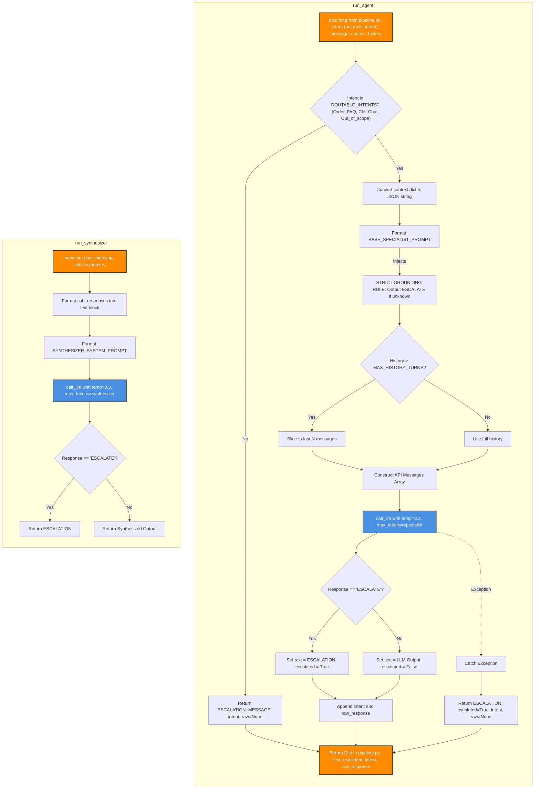

# specialists.py Flow

```mermaid
flowchart TD
    classDef external fill:#FF8C00,stroke:#333,stroke-width:2px,color:#fff;
    classDef agent fill:#4A90E2,stroke:#333,stroke-width:2px,color:#fff;

    %% Specialist Agent Execution Flow (run_agent)
    %% Note: pipeline.py splits multi_intent into multiple parallel calls to run_agent.
    subgraph run_agent
        direction TB
        IncomingRequest["Incoming from pipeline.py: intent (not multi_intent), message, context, history"]:::external --> CheckIntent{"Intent in ROUTABLE_INTENTS? (Order, FAQ, Chit-Chat, Out_of_scope)"}
    
    CheckIntent -->|No| GuardFail[Return ESCALATION_MESSAGE, intent, raw=None]
    CheckIntent -->|Yes| PrepContext[Convert context dict to JSON string]
    
    PrepContext --> BuildPrompt[Format BASE_SPECIALIST_PROMPT]
    BuildPrompt -->|Injects| StrictRule[STRICT GROUNDING RULE: Output ESCALATE if unknown]
    
    StrictRule --> TruncateHistory{History > MAX_HISTORY_TURNS?}
    TruncateHistory -->|Yes| SliceHistory[Slice to last N messages]
    TruncateHistory -->|No| KeepHistory[Use full history]
    
    SliceHistory --> BuildPayload[Construct API Messages Array]
    KeepHistory --> BuildPayload
    
    BuildPayload --> CallLLM[call_llm with temp=0.2, max_tokens=specialist]:::agent
    CallLLM --> CheckEscalation{Response == 'ESCALATE'?}
    
    CheckEscalation -->|Yes| OverrideResponse[Set text = ESCALATION, escalated = True]
    CheckEscalation -->|No| ReturnResponse[Set text = LLM Output, escalated = False]
    
    OverrideResponse --> AppendTracing[Append intent and raw_response]
    ReturnResponse --> AppendTracing
    
    AppendTracing --> OutputResult[Return Dict to pipeline.py: text, escalated, intent, raw_response]:::external
    GuardFail --> OutputResult
    
    %% Error handling
    CallLLM -.->|Exception| CatchError[Catch Exception]
    CatchError --> ErrorReturn[Return ESCALATION, escalated=True, intent, raw=None]
    ErrorReturn --> OutputResult
    end

    %% Synthesizer Execution Flow
    subgraph run_synthesizer
        direction TB
        IncomingSynth[Incoming: user_message, sub_responses]:::external --> FormatResp[Format sub_responses into text block]
        FormatResp --> BuildSynthPrompt[Format SYNTHESIZER_SYSTEM_PROMPT]
        BuildSynthPrompt --> CallSynthLLM[call_llm with temp=0.3, max_tokens=synthesizer]:::agent
        CallSynthLLM --> CheckSynthEscalation{Response == 'ESCALATE'?}
        CheckSynthEscalation -->|Yes| SynthEscalate[Return ESCALATION]
        CheckSynthEscalation -->|No| SynthReturn[Return Synthesized Output]
    end
```
