# Full System Architecture — High-Level View

This diagram shows the **layer structure** of the project. For detailed step-by-step flows, see:
- [`architecture_live_chat.md`](./architecture_live_chat.md) — end-to-end message flow
- [`architecture_eval.md`](./architecture_eval.md) — evaluation pipeline
- [`architecture_dependencies.md`](./architecture_dependencies.md) — file-level imports

```mermaid
flowchart TD
    classDef ui fill:#FF8C00,stroke:#333,stroke-width:2px,color:#fff;
    classDef data fill:#27AE60,stroke:#333,stroke-width:2px,color:#fff;
    classDef agent fill:#4A90E2,stroke:#333,stroke-width:2px,color:#fff;
    classDef eval fill:#9C27B0,stroke:#333,stroke-width:2px,color:#fff;

    subgraph UI ["Streamlit App (app/)"]
        direction TB
        setup["🛍️_Setup.py
        LLM Config, Persona, Tokens"]:::ui
        chat["1_💬_Chat.py
        Live Chat Interface"]:::ui
        history["2_📋_Chat_History.py
        Logs & Data Flywheel"]:::ui
        eval_ui["3_⚖️_Evaluation.py
        Eval Runner UI"]:::ui
        dash["4_📊_Dashboard.py
        Analytics & Metrics"]:::ui
    end

    subgraph DATA ["Data Layer (data/)"]
        direction TB
        policies["policies.json
        Store Rules & Context"]:::data
        datasets["dataset_*.json
        Single, Multi & Extended"]:::data
        sqlite[("eval_results.db
        SQLite Database")]:::data
    end

    subgraph AGENTS ["Agent Layer (agents/)"]
        direction TB
        llm["llm_client.py
        Unified API Wrapper"]:::agent
        gd["guardrails.py
        Input/Output Safety"]:::agent
        ext["entity_extractor.py
        Regex + LLM Entity Extraction"]:::agent
        rtr["router.py
        Intent Classification"]:::agent
        spec["specialists.py
        Policy, Order, FAQ Agents"]:::agent
        cfg["config.py
        Shared Constants"]:::agent
        utl["utils.py
        JSON Parsing, File I/O"]:::agent
    end

    subgraph EVALS ["Evaluation Layer (evals/)"]
        direction TB
        db["db.py
        SQLite Interface"]:::eval
        casc["cascade.py
        Eval Orchestrator"]:::eval
        judge["judge.py
        LLM-as-a-Judge (6-Dim Rubric)"]:::eval
        emb["embeddings.py
        Cosine Similarity"]:::eval
        met["metrics.py
        Spearman, Cohen's, CI"]:::eval
        bias["bias_check.py
        Position Bias Detection"]:::eval
    end

    %% ==========================================
    %% Inter-Layer Flows (high-level only)
    %% ==========================================

    %% UI → Agents (live chat)
    chat -->|"sends message →"| gd
    gd -->|"safe response →"| chat

    %% UI → Evals
    eval_ui -->|"triggers"| casc
    eval_ui -.->|"triggers"| bias

    %% UI → Data (direct reads)
    dash -->|"reads metrics"| db
    history -->|"reads logs"| db
    chat -->|"logs interaction"| db

    %% Agents → Data
    spec -.->|"reads context"| policies
    spec -.->|"looks up orders"| sqlite

    %% Evals → Agents (pipeline is re-used)
    casc -.->|"runs pipeline"| gd

    %% Evals → Data
    casc -->|"loads test cases"| datasets
    casc -->|"saves results"| db
    judge -.->|"LLM call"| llm
    db -->|"persists"| sqlite

    %% Setup → Config (env vars)
    setup -.->|"sets env vars"| cfg
```

