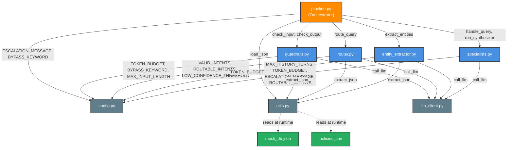

# Architecture: File Dependencies

This diagram shows **which files import what** — making it easy to trace how a change in one module ripples through the system.

**Color Legend:**
- 🟠 **Orange** — Orchestrator (entry point that wires everything together)
- 🔵 **Blue** — Agent modules (contain LLM calls and business logic)
- ⚪ **Grey** — Shared utilities (no LLM, used by many modules)
- 🟢 **Green** — Data files (JSON on disk, read at runtime)

---

## Quick Reference: What Each Shared Module Provides

### config.py
| Constant | Used By |
|----------|---------|
| `VALID_INTENTS` | router |
| `ROUTABLE_INTENTS` | router, specialists |
| `LOW_CONFIDENCE_THRESHOLD` | router |
| `ESCALATION_MESSAGE` | pipeline, specialists |
| `BYPASS_KEYWORD` | pipeline, guardrails |
| `MAX_INPUT_LENGTH` | guardrails |
| `TOKEN_BUDGET` | guardrails, router, extractor, specialists |
| `MAX_HISTORY_TURNS` | specialists |
| `EVAL_PASS_THRESHOLD` | cascade.py |
| `EVAL_WARN_THRESHOLD` | cascade.py |

### utils.py
| Function | Used By | Purpose |
|----------|---------|---------|
| `extract_json()` | guardrails, router, extractor | Safe JSON parsing with 3-tier fallback |
| `load_json()` | pipeline | Cached file reader with `@lru_cache` |

### llm_client.py
| Function | Used By | Purpose |
|----------|---------|---------|
| `call_llm()` | guardrails, router, extractor, specialists | Unified multi-provider API wrapper with backoff retries |
| `call_judge_llm()` | judge.py | Separate judge model call with backoff retries |
| Client Getters | internal | Singletons (`_get_groq_client`, etc.) for connection pooling |
