# Architecture: Evaluation Pipeline

This diagram traces how the eval harness grades the chatbot's performance — from test datasets through the judge LLM to the metrics database.

**Color Legend:**
- 🟠 **Orange** — UI / external triggers
- 🔵 **Blue** — LLM-powered evaluation modules
- ⚪ **Grey** — Data storage and computation (no LLM)

```mermaid
flowchart LR
    classDef ui fill:#FF8C00,stroke:#333,stroke-width:2px,color:#fff;
    classDef agent fill:#4A90E2,stroke:#333,stroke-width:2px,color:#fff;
    classDef util fill:#607D8B,stroke:#333,stroke-width:2px,color:#fff;
    classDef data fill:#27AE60,stroke:#333,stroke-width:2px,color:#fff;

    EvalUI["⚖️ Eval Runner\n(3_Evaluation.py)"]:::ui

    subgraph cascade.py
        direction LR

        LoadCases["1️⃣ Load Test Cases\nfrom dataset_*.json"]:::util
        RunPipeline["2️⃣ Run Chat Pipeline\npipeline.run_pipeline()"]:::agent
        Embed["3️⃣ Compute Similarity\nembeddings.py"]:::util
        Judge["4️⃣ Grade Response\njudge.py (LLM-as-Judge)"]:::agent
        Stats["5️⃣ Aggregate Metrics\nmetrics.py"]:::util
    end

    DB["💾 eval_results.db\n(SQLite)"]:::data
    Dashboard["📊 Dashboard\n(4_Dashboard.py)"]:::ui

    EvalUI --> LoadCases
    LoadCases --> RunPipeline
    RunPipeline --> Embed
    Embed --> Judge
    Judge --> Stats
    Stats --> DB
    DB --> Dashboard
```

---

## Planned Evaluation Dimensions

| Dimension | What It Measures | Score Range |
|-----------|-----------------|-------------|
| Accuracy | Is the answer factually correct against the reference? | 1–5 |
| Groundedness | Is it grounded in context, or does it hallucinate? | 1–5 |
| Safety | Does it avoid harmful, inappropriate, or PII-leaking content? | 1–5 |
| Helpfulness | Does it actually solve the user's problem? | 1–5 |
| Relevance | Is it on-topic and relevant to the query? | 1–5 |
| Tone | Is it professional, empathetic, and appropriate? | 1–5 |

## Production vs Evaluation Mode

| Aspect | Production (Chat UI) | Evaluation Mode |
|--------|---------------------|-----------------|
| **User Context** | `user_email` from logged-in session | `user_email=None` |
| **Order Lookup** | Scoped to user's orders only (IDOR protection) | Look up orders by `order_id` directly |
| **Security** | Prevents seeing other users' orders | Bypasses user scoping for testing |
| **Use Case** | Real users with privacy boundaries | Testing chatbot's order-handling capability |

**Why the dual mode?**
- **Production**: Must respect user boundaries → cannot show Bob's orders to Alice
- **Evaluation**: Must test across all test cases → needs to answer about any order in the test dataset

**Example:**
- Query: `"Can I cancel ORD-1043?"`
- **Production (Alice)**: "I don't see ORD-1043 in your account" (correct - it's Bob's order)
- **Evaluation**: Looks up ORD-1043 directly → "Order ORD-1043 is currently processing..."
