# Architecture: Live Chat Flow

This diagram traces a single user message through the entire pipeline — from the Streamlit UI, through every agent, and back to the user.

**Color Legend:**
- 🟠 **Orange** — UI boundary (data entering/leaving the system)
- 🔵 **Blue** — Agent modules (LLM-powered decision points)
- ⚪ **Grey** — Utility / data-fetching steps (no LLM involved)

```mermaid
flowchart LR
    classDef ui fill:#FF8C00,stroke:#333,stroke-width:2px,color:#fff;
    classDef agent fill:#4A90E2,stroke:#333,stroke-width:2px,color:#fff;
    classDef util fill:#607D8B,stroke:#333,stroke-width:2px,color:#fff;
    classDef esc fill:#E74C3C,stroke:#333,stroke-width:2px,color:#fff;

    User["🧑 User Message\n(from 1_Chat.py)"]:::ui

    subgraph pipeline.py
        direction LR

        InputG["1️⃣ guardrails.py\ncheck_input()"]:::agent
        Router["2️⃣ router.py\nroute_query()"]:::agent
        Entity["3️⃣ entity_extractor.py\nextract_entities()"]:::agent
        Context["4️⃣ pipeline.py\n_fetch_context() (Parallel)"]:::util
        Spec["5️⃣ specialists.py\nrun_agent() (Parallel)"]:::agent
        Synth["6️⃣ specialists.py\nrun_synthesizer()"]:::agent
        OutputG["7️⃣ guardrails.py\ncheck_output()"]:::agent
    end

    Response["💬 Bot Response\n(to 1_Chat.py)"]:::ui
    Escalate["🚨 ESCALATION\n(to human agent)"]:::esc

    User --> InputG
    InputG -->|safe| Router
    InputG -->|"unsafe / token stuffing"| Escalate
    Router -->|"high confidence"| Entity
    Router -->|"low confidence"| Escalate
    Entity --> Context
    Context --> Spec
    Spec -->|"parallel answers"| Synth
    Synth -->|"merged response"| OutputG
    Synth -->|"ESCALATE keyword"| Escalate
    Spec -->|"ESCALATE keyword"| Escalate
    OutputG -->|"safe"| Response
    OutputG -->|"leak / PII detected"| Escalate
```



---

## Detailed Step Breakdown

| Step | File | Function | What Happens |
|------|------|----------|--------------|
| 1 | `guardrails.py` | `check_input()` | Length check → token-stuffing check → LLM prompt-injection detection |
| 2 | `router.py` | `route_query()` | Classifies intent (including `multi_intent` with `sub_intents`) + confidence score |
| 3 | `entity_extractor.py` | `extract_entities()` | Regex for email/order ID → LLM for product name (runs for all matching sub_intents) |
| 4 | `pipeline.py` | `_fetch_context()` | Fetches relevant JSON data in parallel using `ThreadPoolExecutor` |
| 5 | `specialists.py` | `run_agent()` | Builds grounded prompts + history → Parallel execution for each sub_intent |
| 6 | `specialists.py` | `run_synthesizer()` | Takes parallel outputs and merges them into a single cohesive response |
| 7 | `guardrails.py` | `check_output()` | Leak keyword scan → PII regex → pass or block |

## Return Payload
```json
{
  "text": "Your order ORD-1234 is currently in transit...",
  "escalated": false,
  "intent": "order",
  "confidence": 0.95,
  "reasoning": "User is asking about delivery status",
  "is_low_confidence": false,
  "entities": {"order_id": "ORD-1234", "email": null, "product_name": "iPhone"},
  "raw_response": "...",
  "latency_ms": 842
}
```
