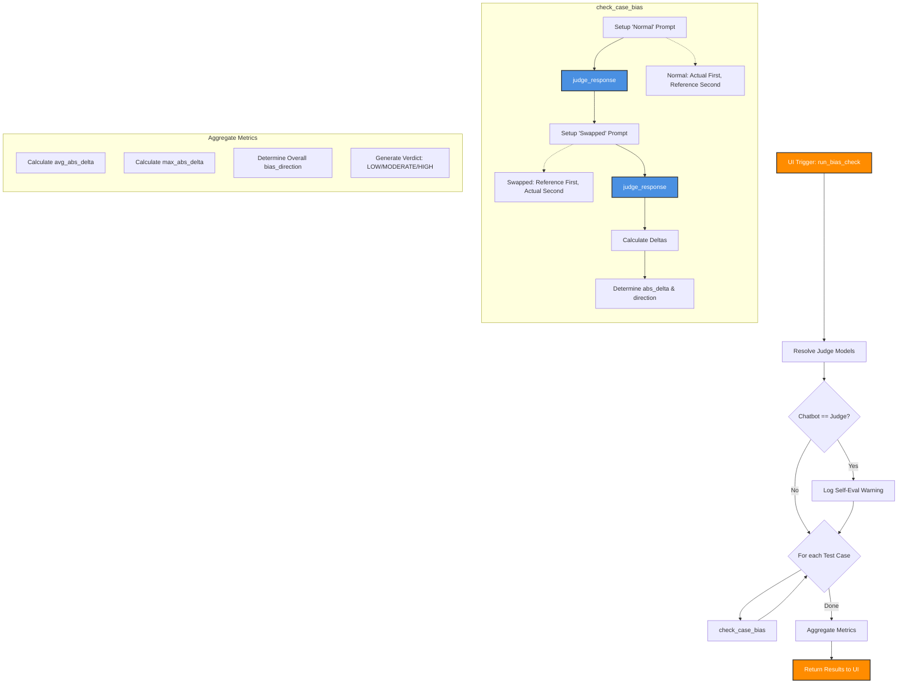

# bias_check.py Flow

```mermaid
flowchart TD
    classDef external fill:#FF8C00,stroke:#333,stroke-width:2px,color:#fff;
    classDef module fill:#4A90E2,stroke:#333,stroke-width:2px,color:#fff;

    Start[UI Trigger: run_bias_check]:::external --> Init[Resolve Judge Models]
    Init --> CheckIdentical{Chatbot == Judge?}
    CheckIdentical -->|Yes| Warn[Log Self-Eval Warning]
    CheckIdentical -->|No| LoopCases
    Warn --> LoopCases{For each Test Case}
    
    LoopCases --> RunCase[check_case_bias]
    
    subgraph check_case_bias
        direction TB
        C1[Setup 'Normal' Prompt] --> C2[judge_response]:::module
        C2 --> C3[Setup 'Swapped' Prompt]
        
        note1[Normal: Actual First, Reference Second]
        note2[Swapped: Reference First, Actual Second]
        C1 -.-> note1
        C3 -.-> note2
        
        C3 --> C4[judge_response]:::module
        C4 --> C5[Calculate Deltas]
        C5 --> C6[Determine abs_delta & direction]
    end
    
    RunCase --> LoopCases
    
    LoopCases -->|Done| Agg[Aggregate Metrics]
    
    subgraph Aggregate Metrics
        direction TB
        A1[Calculate avg_abs_delta]
        A2[Calculate max_abs_delta]
        A3[Determine Overall bias_direction]
        A4[Generate Verdict: LOW/MODERATE/HIGH]
    end
    
    Agg --> Return[Return Results to UI]:::external
```
