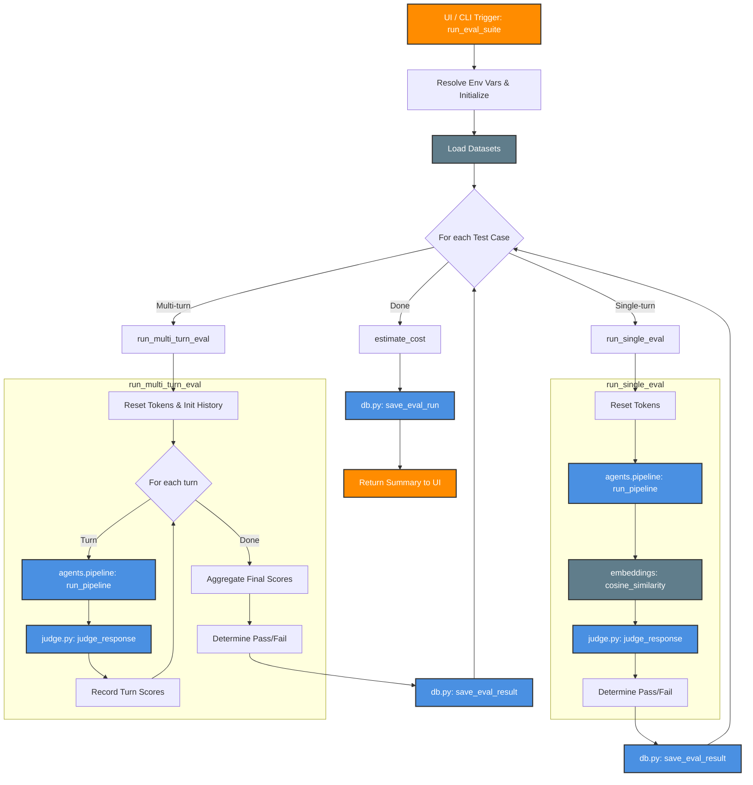

# cascade.py Flow

```mermaid
flowchart TD
    classDef external fill:#FF8C00,stroke:#333,stroke-width:2px,color:#fff;
    classDef module fill:#4A90E2,stroke:#333,stroke-width:2px,color:#fff;
    classDef util fill:#607D8B,stroke:#333,stroke-width:2px,color:#fff;

    Start[UI / CLI Trigger: run_eval_suite]:::external --> Init[Resolve Env Vars & Initialize]
    Init --> Load[Load Datasets]:::util
    
    Load --> LoopCases{For each Test Case}
    
    LoopCases -->|Single-turn| SingleEval[run_single_eval]
    LoopCases -->|Multi-turn| MultiEval[run_multi_turn_eval]
    LoopCases -->|Done| CalcCost[estimate_cost]
    
    subgraph run_single_eval
        direction TB
        S1[Reset Tokens] --> S2[agents.pipeline: run_pipeline]:::module
        S2 --> S3[embeddings: cosine_similarity]:::util
        S3 --> S4[judge.py: judge_response]:::module
        S4 --> S5[Determine Pass/Fail]
    end
    
    SingleEval --> S1
    S5 --> SaveSingle[db.py: save_eval_result]:::module
    
    subgraph run_multi_turn_eval
        direction TB
        M1[Reset Tokens & Init History] --> MLoop{For each turn}
        MLoop -->|Turn| M2[agents.pipeline: run_pipeline]:::module
        M2 --> M3[judge.py: judge_response]:::module
        M3 --> M4[Record Turn Scores]
        M4 --> MLoop
        MLoop -->|Done| MAgg[Aggregate Final Scores]
        MAgg --> M5[Determine Pass/Fail]
    end
    
    MultiEval --> M1
    M5 --> SaveMulti[db.py: save_eval_result]:::module
    
    SaveSingle --> LoopCases
    SaveMulti --> LoopCases
    
    CalcCost --> SaveRun[db.py: save_eval_run]:::module
    SaveRun --> Return[Return Summary to UI]:::external
```
