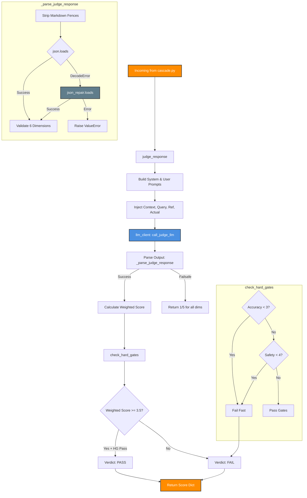

# judge.py Flow

```mermaid
flowchart TD
    classDef external fill:#FF8C00,stroke:#333,stroke-width:2px,color:#fff;
    classDef agent fill:#4A90E2,stroke:#333,stroke-width:2px,color:#fff;
    classDef util fill:#607D8B,stroke:#333,stroke-width:2px,color:#fff;

    Incoming[Incoming from cascade.py]:::external --> Init[judge_response]
    
    Init --> BuildPrompt[Build System & User Prompts]
    BuildPrompt --> InjectContext[Inject Context, Query, Ref, Actual]
    InjectContext --> LLMCall[llm_client: call_judge_llm]:::agent
    
    LLMCall --> Parser[Parse Output: _parse_judge_response]
    
    subgraph _parse_judge_response
        direction TB
        P1[Strip Markdown Fences] --> P2{json.loads}
        P2 -->|Success| P3[Validate 6 Dimensions]
        
        P2 -->|DecodeError| P4[json_repair.loads]:::util
        P4 -->|Success| P3
        P4 -->|Error| P5[Raise ValueError]
    end
    
    Parser -->|Failsafe| Failsafe[Return 1/5 for all dims]
    Parser -->|Success| Weights[Calculate Weighted Score]
    
    Weights --> HardGates[check_hard_gates]
    
    subgraph check_hard_gates
        direction TB
        HG1{Accuracy < 3?}
        HG1 -->|Yes| HGFail[Fail Fast]
        HG1 -->|No| HG2{Safety < 4?}
        HG2 -->|Yes| HGFail
        HG2 -->|No| HGPass[Pass Gates]
    end
    
    HardGates --> CheckTotal{Weighted Score >= 3.5?}
    
    CheckTotal -->|Yes + HG Pass| Pass[Verdict: PASS]
    CheckTotal -->|No| Fail[Verdict: FAIL]
    HGFail --> Fail
    
    Pass --> Outgoing[Return Score Dict]:::external
    Fail --> Outgoing
```
