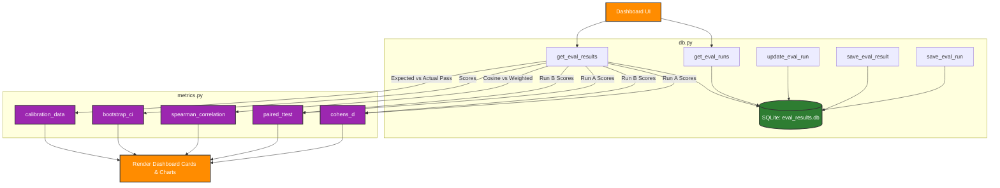

# metrics.py & db.py Flow

```mermaid
flowchart TD
    classDef external fill:#FF8C00,stroke:#333,stroke-width:2px,color:#fff;
    classDef db fill:#2E7D32,stroke:#333,stroke-width:2px,color:#fff;
    classDef stats fill:#9C27B0,stroke:#333,stroke-width:2px,color:#fff;

    subgraph db.py
        direction TB
        DBInit[(SQLite: eval_results.db)]:::db
        
        SaveRun[save_eval_run] --> DBInit
        SaveRes[save_eval_result] --> DBInit
        UpdateRun[update_eval_run] --> DBInit
        
        GetRuns[get_eval_runs] --> DBInit
        GetRes[get_eval_results] --> DBInit
    end

    subgraph metrics.py
        direction TB
        M_Cohens[cohens_d]:::stats
        M_TTest[paired_ttest]:::stats
        M_Spearman[spearman_correlation]:::stats
        M_Boot[bootstrap_ci]:::stats
        M_Calib[calibration_data]:::stats
    end
    
    UI_Dash[Dashboard UI]:::external --> GetRuns
    UI_Dash --> GetRes
    
    GetRes -->|Run A Scores| M_Cohens
    GetRes -->|Run B Scores| M_Cohens
    
    GetRes -->|Run A Scores| M_TTest
    GetRes -->|Run B Scores| M_TTest
    
    GetRes -->|Cosine vs Weighted| M_Spearman
    GetRes -->|Scores| M_Boot
    
    GetRes -->|Expected vs Actual Pass| M_Calib
    
    M_Cohens --> DashRender[Render Dashboard Cards & Charts]:::external
    M_TTest --> DashRender
    M_Spearman --> DashRender
    M_Boot --> DashRender
    M_Calib --> DashRender
```
